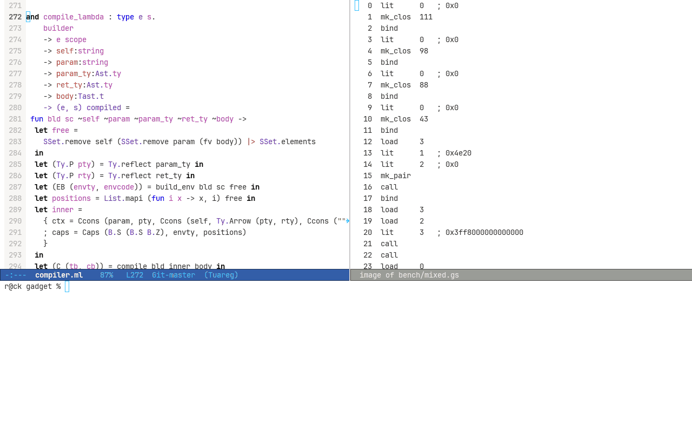

Typed bytecode VM in OxCaml that indexes instructions by the type of the operand stack. The
instruction set is a GADT indexed by the type of the operand stack so ill typed bytecode
fails to compile instead of failing to run and every runtime value is a single unboxed 64
bit word so the eval loop allocates nothing at all



## Build

This needs OxCaml as it doesnt build on stock OCaml and uses unboxed arrays and layout
polymorphic array primitives

```sh
opam switch create ox 5.4.0+ox \
  --repos ox=git+https://github.com/oxcaml/opam-repository.git,default
eval $(opam env --switch=ox)
opam install dune
dune build
dune test
```

## Notes

- The GADT is the IR and an instruction is `('e, 's, 't) instr` where `'e` is the frame as
  a type level list and `'s` and `'t` are the operand stack shape going in and coming back
  out
- `Iarith` is `('e, int * (int * 's), int * 's) instr` so applying it to a `Bool` fails to
  unify and ill typed bytecode is rejected by the host typechecker before anything runs

  ```ocaml
  let bad : (unit, unit, int * unit) code = [ Lit_bool true; Lit_int 1; Iarith Add ]
  (* Error: Type int is not compatible with type bool *)
  ```

- `code` redefines `[]` and `( :: )` so a basic block is an ordinary list literal that gets
  checked as a stack machine while it is written
- `Load` carries a de Bruijn witness instead of an int and `Mk_clos` carries the callees
  whole typed body so a call can never reach a body of the wrong type
- A recursive descent parser feeds a bidirectional typechecker producing a typed AST which
  is closure converted into the GADT and then erased into a flat image of one 32 bit word
  per instruction
- Every value is one 64 bit word so the operand stack and the frame store and the arena are
  all `int64# array` laid out flat at 8 bytes per element where a boxed `int64 array` would
  cost 32
- Reading a slot back as a float needs no tag check because the index already fixed the
  type of that slot when the image was emitted
- 4 interpreters exist so the benchmark isolates one variable at a time and they are the
  flat unboxed image and the same image over runtime tagged values and a direct GADT walk
  over boxed host values and a typed AST walker
- The index is erased before execution so the image and the eval loop are byte for byte
  what an untyped compiler would produce and the disassembled loop has zero allocation
  points and a jump table dispatch
